 

## terminal

 

## selected work

| | Project | Stack |
| :-- | :--- | :--- |
| `01` | **[Parsec](https://github.com/Naman30903/Parsec)** | `Go` |
| `02` | **[resqlink-backend](https://github.com/Naman30903/resqlink-backend)** | `Go` |
| `03` | **[smart_trip_planner_flutter](https://github.com/Naman30903/smart_trip_planner_flutter)** | `Flutter` |
| `04` | **[crop_guard](https://github.com/Naman30903/crop_guard)** | `Flutter` |
| `05` | **[ezy-expense](https://github.com/Naman30903/ezy-expense)** | `Flutter` |
| `06` | **[Hedge-Pro](https://github.com/Naman30903/Hedge-Pro)** | `JavaScript` |

<!-- TODO(Naman): add a third column with a one-line description once the repos
     themselves have descriptions set. Right now most are null on GitHub. -->

 

## stack

 

## contributions

  

<!-- Renders once .github/workflows/snake.yml has run and created the output branch. -->
<picture>
  <source media="(prefers-color-scheme: dark)" srcset="https://raw.githubusercontent.com/Naman30903/Naman30903/output/snake-dark.svg" />
  <source media="(prefers-color-scheme: light)" srcset="https://raw.githubusercontent.com/Naman30903/Naman30903/output/snake.svg" />
  
</picture>

<!-- ──────────────────────────────────────────────────────────
     Stats cards left out on purpose: github-readme-stats.vercel.app
     is returning 503 DEPLOYMENT_PAUSED and github-profile-trophy
     returns 402. Self-host github-readme-stats, then add:
     
     ────────────────────────────────────────────────────────── -->

 

## elsewhere

